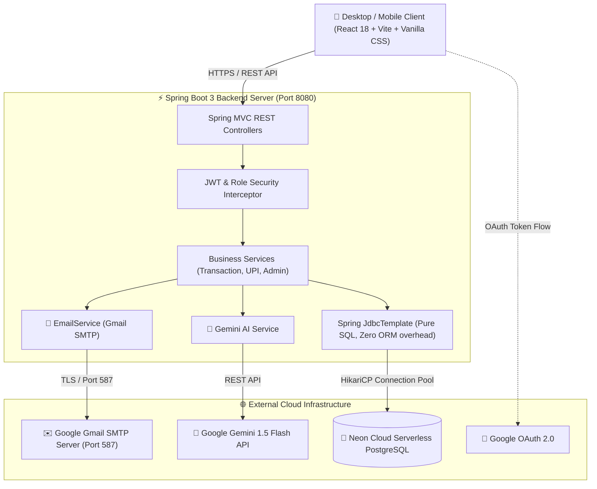

# ⚡ FinTrack — AI-Powered Personal Wealth & Financial Management Platform

[](https://www.oracle.com/java/)
[](https://spring.io/projects/spring-boot)
[](https://react.dev/)
[](https://neon.tech/)
[](https://ai.google.dev/)
[](LICENSE)

> **FinTrack** is a modern, full-stack personal finance and wealth intelligence platform. Built with **Spring Boot 3, Pure Spring JDBC (Raw SQL), React 18, Neon Serverless PostgreSQL, Google Gemini AI, and Google OAuth 2.0**, FinTrack enables users to track income/expenses, monitor UPI app activity, manage bank cards, generate AI-driven financial advice, and enforce enterprise-grade security.

---

## 🌐 Live Deployment & Links

| Service | Environment | URL |
| :--- | :--- | :--- |
| **Live Web App** | Render (All-in-One) | [https://fintrack-fpo4.onrender.com](https://fintrack-fpo4.onrender.com) |
| **Local Frontend** | Vite Dev Server | `http://localhost:5173` |
| **Local Backend API**| Spring Boot Server | `http://localhost:8080` |
| **Cloud Database** | Neon Serverless PostgreSQL | `ep-delicate-hat-ax0144hv-pooler.c-4.us-east-2.aws.neon.tech` |

---

## 🏗️ System Architecture



---

## 🚀 Key Features (Phase 1 Implemented)

### 1. 🔐 Enterprise Authentication & Dual Security Flow
- **Email + Password Registration**: Enforces a strict 3-rule security password policy:
  - Minimum 8 characters long
  - Must start with an Uppercase letter (`A-Z`)
  - Must contain at least one special character (`!@#$%^&*`)
- **Real 6-Digit Email OTP Verification**: Dispatches real verification emails via **Gmail SMTP (`spring-boot-starter-mail`)** directly to user inboxes with a 10-minute validity window.
- **Strict Google OAuth 2.0 Registration-First Flow**:
  - Automatically verifies if the Google email address exists in the Neon database.
  - Unregistered users are safely blocked with a clear warning: *"No FinTrack account found for '...'. Please register your account first."*
- **Stateless JWT Tokens**: HMAC-SHA256 signed JSON Web Tokens for session handling.

### 2. 🤖 Google Gemini AI Financial Intelligence
- **AI Financial Advisor Chatbot (`/api/ai/chat`)**: Context-aware advisor evaluating total savings, spending velocity, budget health, and emergency runway.
- **Smart Transaction Categorization (`/api/ai/categorize`)**: Analyzes transaction notes and merchant names to automatically categorize expenses into Food, Utilities, Shopping, Investment, etc.
- **Deterministic Rule Fallback**: Fully functional offline rule-based heuristic advisor ensuring 100% uptime when external AI endpoints are unavailable.

### 3. 💳 UPI Hub & Bank Card Aggregator Module *(Architectural Prototype)*
- **Unified Multi-App Overview**: Visual dashboard monitoring **Google Pay, PhonePe, Paytm, CRED, Amazon Pay, BHIM UPI, and WhatsApp Pay**.
- **Clean Unlinked Card State**: Displays a clean `No Bank Linked` and `XXXX XXXX XXXX XXXX` masked state for newly registered accounts.
- **Interactive Card Management Modal**: Allows users to link bank cards with custom Bank Name, Cardholder Name, 16-digit Number, Expiry, CVV, and Card Type (Debit/Credit/Forex).
- **Multi-App Transaction Synchronization**: Instantly aggregates mock transactions into the unified financial statement.

> [!NOTE]
> **Prototype Model Disclosure**: The current UPI & Card Linking module in Phase 1 is a functional architectural simulation model designed according to real-world fintech standards (CoFT Tokenization and Account Aggregator consent models) without handling live sensitive banking credentials in development.

### 4. 📊 Financial Analytics & Transaction Management
- **Summary Metrics**: Real-time Total Income, Total Expenses, Net Savings, and Savings Rate percentage.
- **Interactive Data Visualizations**: Recharts-powered monthly income vs. expense bar charts and category distribution donut charts.
- **Advanced Filtering & Pagination**: Filter by Type, Category, Date range, Min/Max amount, keyword search, and multi-column sorting.
- **CSV Data Export**: Instant 1-click download of all transaction history.

### 5. 📱 Full Responsive Design & Fintech Aesthetics
- Clean dark/light contrast with orange fintech accents (`#FF6B00`).
- Touch-friendly 44px minimum action buttons with micro-elevation transitions.
- Responsive slide-out navigation drawer with mobile hamburger menu supporting screen sizes down to 320px.

### 6. 🛡️ Role-Based Admin Management Console (`/admin`)
- Administrative dashboard with system-wide analytics, user counts, and total transaction volume.
- Individual user financial portfolio inspection and account deletion tools.

---

## 🔮 Phase 2 Roadmap & Future Integrations

```
Phase 2A: AI Statement Ingestion (PDF / CSV) ────▶ 1-Click Upload for GPay / PhonePe / Bank Statements
Phase 2B: RBI Card Tokenization (CoFT)       ────▶ Real Card Vaulting via Razorpay / Cashfree Sandbox
Phase 2C: RBI Account Aggregator (AA)        ────▶ Official Real-Time Bank & UPI Sync via Setu / OneMoney
Phase 2D: Android SMS Parsing Engine         ────▶ Background Transaction Detection from Bank SMS
```

### 📄 Phase 2A: AI Bank & UPI Statement Ingestion (PDF / CSV)
- **Problem**: Users frequently download transaction statements from PhonePe, Google Pay, Paytm, or net banking.
- **Solution**: Drag-and-drop bank statement PDF/CSV upload where **Gemini AI Multi-Modal** automatically parses every row (Date, Merchant, UPI ID, Category, Amount) and writes them directly to PostgreSQL.

### 🔒 Phase 2B: RBI Card-on-File Tokenization (CoFT) Sandbox
- **Regulatory Standard**: In compliance with RBI and PCI-DSS regulations, raw 16-digit card numbers are never stored on application servers.
- **Implementation**: Integration with **Razorpay / Cashfree / Stripe Card Tokenization API** to vault cards with simulated 3D-Secure bank OTPs, saving only secure network tokens (`token_id`, `last4`, `bank_name`).

### 🏦 Phase 2C: RBI Account Aggregator (AA) Framework
- **Regulatory Standard**: The official legal data-sharing framework licensed by the Reserve Bank of India (NBFC-AA).
- **Implementation**: Integration with **Setu AA (Pine Labs) / OneMoney Sandbox** to enable users to link their HDFC, SBI, ICICI, or Axis bank accounts with official OTP consent for automated real-time transaction synchronization.

### 📲 Phase 2D: Android Transactional SMS Parser
- **Implementation**: A lightweight companion Android client reading transactional bank SMS (e.g., *"Debited Rs. 450 via UPI to Swiggy on 14-Aug"*) to automatically record expenses in real-time.

---

## 💻 Tech Stack Details

| Layer | Technology | Description |
| :--- | :--- | :--- |
| **Frontend** | React 18, Vite 5, React Router v6 | High-performance single page application |
| **Icons & Charts** | Lucide React, Recharts | Data visualizations and vector iconography |
| **Styling** | Vanilla CSS Design System | Custom tokens, responsive glassmorphism, fluid typography |
| **Backend** | Java 17, Spring Boot 3.2.5 | Enterprise REST API service |
| **Database Access** | Spring JdbcTemplate | Pure raw SQL queries for maximum speed & zero ORM overhead |
| **Database** | Neon Serverless PostgreSQL | Cloud PostgreSQL with connection pooling |
| **Security** | Spring Security, jBCrypt, JJWT | BCrypt hashing, stateless HMAC-SHA256 JWT tokens |
| **Email Delivery** | Spring Boot Starter Mail, Gmail SMTP | Real HTML verification code delivery via TLS |
| **AI Engine** | Google Gemini 1.5 Flash API | Multi-turn conversational AI financial advisor |
| **Deployment** | Render Docker / Web Service | All-in-One fullstack containerized deployment |

---

## 🛠️ Local Development Setup

### 1. Prerequisites
- **Java JDK 17+**
- **Node.js 18+ & npm**
- **Maven 3.9+**
- **Git**

---

### 2. Clone the Repository
```bash
git clone https://github.com/sohan-12/FinTrack.git
cd FinTrack
```

---

### 3. Backend Setup
1. Navigate to the backend folder:
   ```bash
   cd backend
   ```
2. Create your `.env` file (see `.env.example`):
   ```env
   DB_URL=jdbc:postgresql://ep-delicate-hat-ax0144hv-pooler.c-4.us-east-2.aws.neon.tech/neondb?sslmode=require
   DB_USERNAME=neondb_owner
   DB_PASSWORD=npg_S6GnTmEiAe2w
   JWT_SECRET=404E635266556A586E3272357538782F413F4428472B4B6250645367566B5970
   GEMINI_API_KEY=your_gemini_api_key
   MAIL_USERNAME=your_email@gmail.com
   MAIL_PASSWORD=your_16_char_gmail_app_password
   ```
3. Run the Spring Boot application:
   ```bash
   mvn compile spring-boot:run
   ```
   *The backend will start at `http://localhost:8080`.*

---

### 4. Frontend Setup
1. Open a new terminal in the `frontend` folder:
   ```bash
   cd frontend
   npm install
   ```
2. Create `frontend/.env`:
   ```env
   VITE_API_BASE_URL=http://localhost:8080/api
   VITE_GOOGLE_CLIENT_ID=898658444271-bn57r25ekp761se1kvo3jsnneh0jgohd.apps.googleusercontent.com
   ```
3. Start the Vite development server:
   ```bash
   npm run dev
   ```
   *The frontend will start at `http://localhost:5173`.*

---

### 5. Build for Production (All-in-One)
```bash
# Build React frontend
cd frontend
npm run build

# Copy build to Spring Boot static resources
# (Windows PowerShell)
Remove-Item -Recurse -Force -Path '..\backend\src\main\resources\static\*'
Copy-Item -Recurse -Path 'dist\*' -Destination '..\backend\src\main\resources\static\'

# Run complete All-in-One application on port 8080
cd ..\backend
mvn compile spring-boot:run
```

---

## 🔌 Connecting pgAdmin 4 to Neon Cloud PostgreSQL

To inspect and manage live users and transactions directly in **pgAdmin 4**:

1. Open **pgAdmin 4** $\rightarrow$ Right-click **Servers** $\rightarrow$ **Register** $\rightarrow$ **Server...**
2. **General Tab**:
   - **Name**: `FinTrack Neon Cloud`
3. **Connection Tab**:
   - **Host**: `ep-delicate-hat-ax0144hv-pooler.c-4.us-east-2.aws.neon.tech`
   - **Port**: `5432`
   - **Maintenance database**: `neondb`
   - **Username**: `neondb_owner`
   - **Password**: `npg_S6GnTmEiAe2w`
   - Check ☑️ **Save password?**
4. **SSL Tab**:
   - **SSL mode**: `Require`
5. Click **Save** $\rightarrow$ Navigate to **neondb $\rightarrow$ Schemas $\rightarrow$ public $\rightarrow$ Tables $\rightarrow$ users**.

---

## 📡 REST API Reference Catalog

### Authentication Endpoints (`/api/auth`)
| Method | Endpoint | Description | Auth Required |
| :--- | :--- | :--- | :--- |
| `POST` | `/api/auth/send-otp` | Generates & sends 6-digit verification code to email | No |
| `POST` | `/api/auth/register` | Verifies OTP, hashes password & registers user | No |
| `POST` | `/api/auth/login` | Email & password login, returns JWT token | No |
| `POST` | `/api/auth/google` | Google OAuth login (requires registered user) | No |
| `GET` | `/api/auth/me` | Fetches current authenticated user profile | Bearer Token |
| `PUT` | `/api/auth/password` | Updates account password (enforces 3-rule policy)| Bearer Token |

### Transaction Endpoints (`/api/transactions`)
| Method | Endpoint | Description | Auth Required |
| :--- | :--- | :--- | :--- |
| `GET` | `/api/transactions` | Filtered, sorted, paginated transactions | Bearer Token |
| `POST` | `/api/transactions` | Creates new income or expense transaction | Bearer Token |
| `PUT` | `/api/transactions/{id}` | Updates existing transaction | Bearer Token |
| `DELETE`| `/api/transactions/{id}` | Deletes transaction | Bearer Token |
| `GET` | `/api/transactions/summary` | Financial summary (income, expenses, net savings)| Bearer Token |
| `GET` | `/api/transactions/export` | Generates downloadable CSV statement | Bearer Token |

### AI Financial Advisor (`/api/ai`)
| Method | Endpoint | Description | Auth Required |
| :--- | :--- | :--- | :--- |
| `POST` | `/api/ai/chat` | Conversational financial advisor chat | Bearer Token |
| `POST` | `/api/ai/categorize` | Smart expense category deduction | Bearer Token |

### UPI & Banking Hub (`/api/upi`)
| Method | Endpoint | Description | Auth Required |
| :--- | :--- | :--- | :--- |
| `GET` | `/api/upi/apps` | Fetches all supported UPI apps & connection state| Bearer Token |
| `POST` | `/api/upi/connect` | Connects UPI application with 4-digit SMS OTP | Bearer Token |
| `POST` | `/api/upi/disconnect`| Disconnects UPI application | Bearer Token |
| `POST` | `/api/upi/sync` | Syncs latest external UPI transactions | Bearer Token |

### Admin Console (`/api/admin`)
| Method | Endpoint | Description | Auth Required |
| :--- | :--- | :--- | :--- |
| `GET` | `/api/admin/stats` | System-wide performance & user metrics | Admin Token |
| `GET` | `/api/admin/users` | Lists all registered accounts | Admin Token |
| `GET` | `/api/admin/users/{id}/portfolio` | Inspects specific user portfolio & transactions | Admin Token |
| `DELETE`| `/api/admin/users/{id}` | Deletes user and associated records | Admin Token |

---

## 📄 License
This project is licensed under the **MIT License** — see the [LICENSE](LICENSE) file for details.

---

<div align="center">
  <sub>Built with ❤️ by Sohan Kumar Sahu & the FinTrack Team.</sub>
</div>
